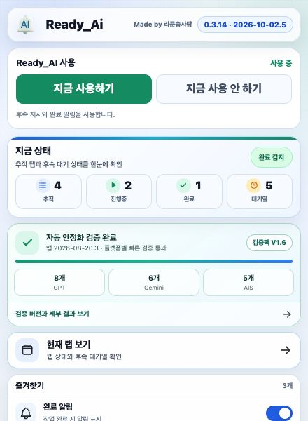
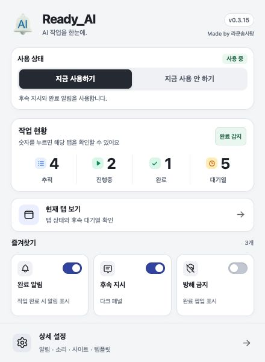
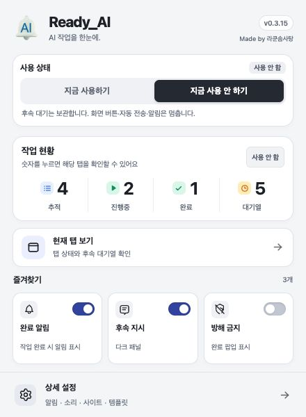
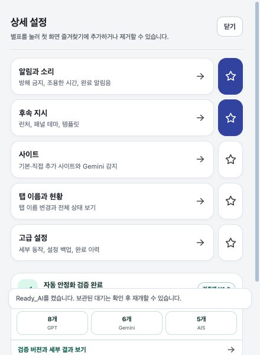

# Ready_AI 보드 개선 · 0.3.15

대상은 확장 아이콘을 눌렀을 때 열리는 440×600 팝업이다. 배포 HTML·CSS·JavaScript를 그대로 실행한 로컬 미리보기에서 샘플 탭 상태로 확인했다. 미리보기용 Chrome API 대체 파일은 배포 압축 파일에 포함하지 않았다.

## 화면별 확인

1. 첫 화면 — 개선 완료. 기존의 검증 카드가 즐겨찾기와 설정을 아래로 밀던 문제를 해결했다. 검증 기록은 설정으로 이동했고, 상태 숫자는 해당 탭 목록을 여는 버튼이 되었다. 기본 즐겨찾기 3개는 스크롤 없이 표시된다.
2. 사용 안 함 — 정상. 선택 버튼과 상태 배지가 바뀌고, 대기를 보관한다는 안내가 표시된다. 새 사용 상태에 맞춰 현황 배지도 회색으로 표시된다. 안내 메시지는 잠시 뒤 사라진다.
3. 상태별 목록 — 정상. 진행 숫자에서 진행 탭 2개, 대기 숫자에서 대기가 있는 탭 2개와 대기 합계 5를 확인했다. 닫기 버튼으로 첫 화면에 돌아왔다.
4. 설정과 즐겨찾기 — 정상. 설정에서 검증 기록에 접근할 수 있다. 즐겨찾기를 전부 제거하면 추가 방법이 표시된다. 키보드 Space로 스위치를 바꾼 뒤에도 포커스가 유지된다.

## 화면 근거

## 확인 범위

- 자동 검증 9개 묶음 1회 통과, JavaScript 30개 문법 검사 통과.
- Chrome에서 440×600 팝업 크기로 확인. 기본 상태의 스크롤 높이는 600으로, 불필요한 스크롤이 없다.
- 처음 설정한 즐겨찾기 3개, 즐겨찾기 없음, 사용 전환, 숫자별 필터, 설정 이동, 키보드 스위치를 확인했다.
- 탭 숫자는 샘플 데이터이며, 설치된 확장의 재적용 및 실제 계정 상태 확인과 구분한다. 전체 접근성 적합성을 인증한 결과는 아니다.

## 실제 대기 복구 확인

실제 ChatGPT 시험 탭에서 첫 질문 전 시험 지시를 한 번 Enter로 대기시켰다. 전송하지 않은 대기 1개와 별도의 작성 중인 지시가 새로고침 후 함께 복구됐으며, 복구한 대기는 수동으로 다음 보내기를 누르기 전까지 멈췄다. 다른 대화로 이동하면 대기 0개와 빈 입력이 나타났고, 원래 화면으로 돌아오면 기존 대기 1개와 작성 내용이 복구됐다. 시험 탭은 확인 후 닫았다. 실제 40분 Pro 응답을 실행한 검증은 아니다.

디자인은 단색 배경, 얇은 경계선, 진한색 선택 버튼과 절제된 상태 색을 사용한다. 버전은 작게 표시하며 제작자 표시는 헤더에 유지했다. 상세 설정 버튼은 보드 하단에 고정한다.
