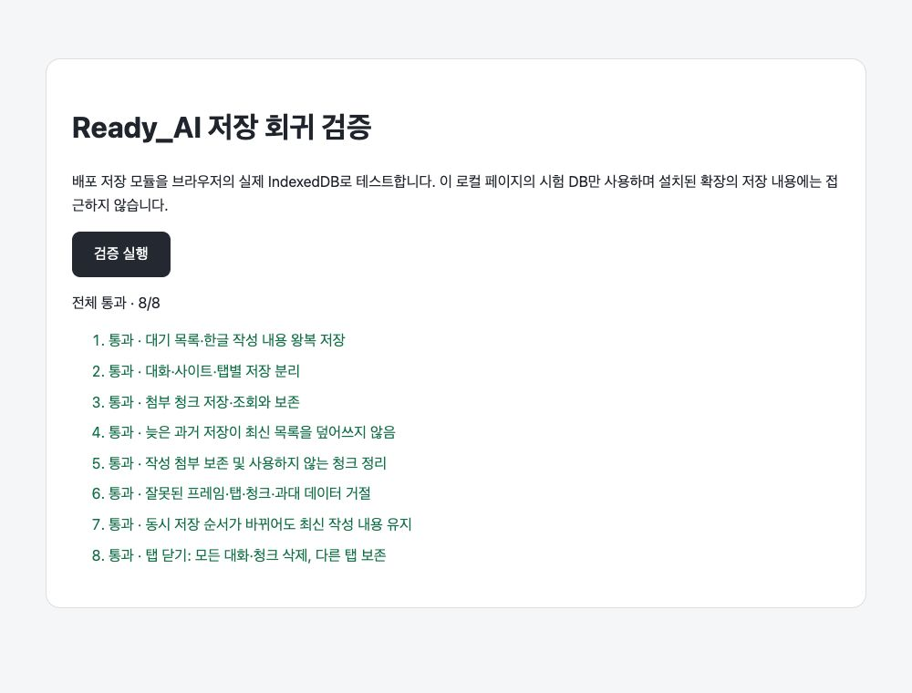
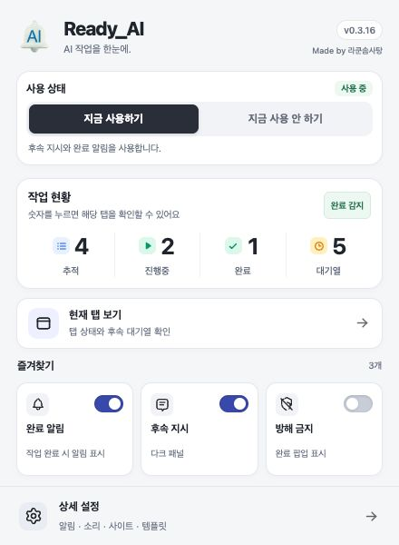

# Ready_AI 0.3.16 검증 기록

검증일: 2026-10-02. 콘텐츠 빌드: `2026-10-02.7-safe-session-recovery`.

## 발견하고 수정한 문제

1. 대화를 A → B → A로 빠르게 왕복하는 동안 첫 A의 첨부 복구가 뒤늦게 끝나면 현재 A의 작성 내용과 복구 잠금이 덮어써졌다. 복구마다 순번을 부여해 최신 복구만 적용한다.
2. 대화 복구가 예전 세션 토큰을 되살려 이전 방문의 전송 결과를 현재 방문의 결과로 받아들일 수 있었다. 현재 방문의 토큰을 유지한다.
3. 패널을 열거나 닫아도 저장 비교 값이 같아 마지막 열림 상태가 저장되지 않았다. 패널 상태를 저장 비교에 포함한다.
4. 전체 사용 중지는 현재 대기만 멈추고 다른 대화의 메모리 대기는 재개 가능 상태로 남겼다. 기억 중인 모든 대화의 대기를 멈추며 다시 켜도 확인 전 자동 재개하지 않는다.

`tools/test-session-recovery-races.js`에서 각 결함을 수정 전에 실패로 재현하고 수정 후 통과를 확인했다. 이 검증은 기존 RECOVERY-01 자동 묶음에 포함된다.

## 자동 검증

- `node tools/run-verification-suite.js --full`: 9개 묶음 × 5회 = 45회 통과.
- JavaScript 32개 `node --check` 통과, `git diff --check` 통과.
- Enter/Ctrl/Cmd+Enter/Shift+Enter·한글 조합, 빠른 입력·중복 전송, 이미지 편집, AI Studio 완료 감지, 절전 복귀, 중복 주입, 화면 위치를 기존 검증으로 확인했다.
- Pro 응답의 10/40/90분 경과 시뮬레이션, 실제 전송 확인 전 대기 보존, 전송 중 순서 변경, 다른 대화의 늦은 전송 결과, 파일 바이트 왕복을 확인했다.

## 실제 브라우저 확인

`tools/browser-session-storage.html`에서 배포 저장 모듈을 실제 Chrome IndexedDB로 실행해 8개 시나리오를 확인했다. 이 로컬 페이지의 DB를 사용하므로 설치된 확장의 사용자 데이터에는 접근하지 않는다.

1. 한글 대기·작성 내용 저장과 조회.
2. 대화·사이트·탭별 격리.
3. 약 1MB 파일 청크 저장과 바이트 일치.
4. 늦은 과거 저장 거절 및 첨부 보존.
5. 작성 첨부 보존과 사용하지 않는 청크 정리.
6. 잘못된 소유자·프레임·청크·과대 데이터 거절.
7. 동시 저장 순서가 바뀌어도 최신 내용 유지.
8. 탭 닫기 정리 함수가 해당 탭의 모든 대화·청크를 삭제하고 다른 탭을 보존.

배포 보드 HTML/CSS/JS에 샘플 Chrome API를 연결한 별도 미리보기에서 빠른 사용 전환, 검색 결과 없음, 숫자 필터 선택 시 검색 초기화, Escape로 닫기, Space 스위치 조작 후 포커스 유지, 즐겨찾기 6개 추가 및 하단 항목 접근을 확인했다. 검증 센터에는 새 앱 빌드와 5회 검증 기록이 표시된다. 미리보기용 API 파일은 배포 ZIP에 포함하지 않는다.

## 확인 범위의 한계

실제 ChatGPT에서는 앞선 0.3.15 저장 연결로 전송하지 않은 시험 대기와 작성 내용의 새로고침 복구, 다른 대화로 이동 및 복귀를 확인했다. 이번 0.3.16의 추가 결함 수정은 자동 회귀 테스트로 확인했다. 실제 Pro 응답을 40분 실행하거나 이번에 Gemini·AI Studio에 메시지를 전송한 검증은 아니다. 기존 실웹 전체 시나리오의 과거 통과 기록과 예약 상태는 유지했다.

분리된 저장 검증을 다시 실행하려면 저장소 루트에서 `python3 -m http.server 8769 --bind 127.0.0.1`을 실행하고 `http://127.0.0.1:8769/tools/browser-session-storage.html`을 연 뒤 **검증 실행**을 누른다.
